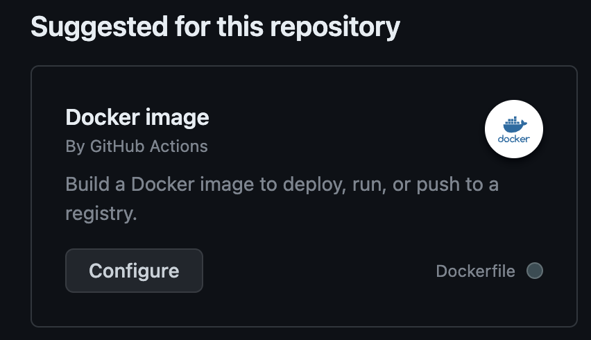

# Node-ci-cd

Dans ce guide, nous allons créer une application Node.js très simple qui effectuera un test, déclenchera les actions GitHub pour exécuter ces tests, puis construira une image Docker qui sera ensuite poussée vers notre dépôt DockerHub.

Nous allons également mettre en place deux secrets de dépôt pour stocker notre token d'accès Docker et notre nom d'utilisateur DockerHub. Ces informations sont essentielles pour permettre le push de notre image vers Docker Hub grâce à l'action GitHub.

Étapes
Les étapes de ce processus incluent :

App
Test
Dockerfile
Action
Docker

Une fois que le projet est en place, nous allons créer une image Docker et la tester avant de la pousser vers le dépôt DockerHub.

```zsh
docker image build -t app_ci .  
docker run --name=app_ci -d -p=3001:3000 app_ci   //  Pour tester si tout est ok
```

Vous pourrez ensuite accéder à l'application à l'adresse http://localhost:3000 et vérifier qu'elle fonctionne correctement.

Ce processus automatisé garantit que votre application Node.js est testée, construite et déployée de manière transparente à chaque modification du code source.


#### Configuration de l'Action Git
Nous allons maintenant configurer l'action Git pour l'intégration continue de notre application Node.js. Voici le fichier de configuration YAML associé à cette action :

Pour obtenir ce fichier aller dans Git action > new workflow > et chercher  'Docker image '



```yaml
name: Node.js CI

on:
  push:
    branches: [ "main" ]
  pull_request:
    branches: [ "main" ]

jobs:
  build:
    runs-on: debian-latest

    strategy:
      matrix:
        node-version: [20.10]

    steps:
    - uses: actions/checkout@v3
    - name: Utilisation de Node.js ${{ matrix.node-version }}
      uses: actions/setup-node@v3
      with:
        node-version: ${{ matrix.node-version }}
        cache: 'npm'
    - run: npm ci
    - run: npm run build --if-present
    - run: npm test
```
Cette configuration déclenche l'action chaque fois qu'il y a un "push" sur la branche "main" ou une "pull request" sur la même branche. Le processus s'exécute sur un environnement Debian, bien que vous puissiez personnaliser cette partie en fonction de vos besoins.

L'action utilise la version Node.js spécifiée dans la matrice (dans cet exemple, 20.10). Les étapes suivantes incluent la récupération du code source via *actions/checkout*, la configuration de l'environnement Node.js, l'installation des dépendances avec *npm ci*, la construction de l'application avec *npm run build* si le script est présent, et enfin, l'exécution des tests avec *npm test*.

N'oubliez pas de valider et de commit ce fichier de configuration dans votre dépôt Git pour activer l'intégration continue de votre application Node.js et de pull dans votre IDE pour eviter les conflits.


#### Generer clé d'accées sur dockerHub

- Pour générer la clé d'accès à Docker Hub, suivez ces étapes :

Connectez-vous à votre compte Docker Hub.

- Cliquez sur votre profil dans le coin supérieur droit, puis sélectionnez "Account Settings".

- Dans la barre latérale gauche, cliquez sur "Security".

- Sous "Access Tokens", cliquez sur "New Access Token".

- Configurez le jeton en lui donnant un nom significatif et assurez-vous de sélectionner les autorisations appropriées. Dans ce cas, assurez-vous de sélectionner les autorisations "Read" et "Write".

- Cliquez sur le bouton "Generate".

- Une fois le jeton généré, copiez-le.

Maintenant que vous avez votre jeton d'accès Docker Hub, vous pouvez l'utiliser dans votre workflow GitHub.


#### Configuration des Secrets et des Variables

Pour configurer les secrets nécessaires à votre workflow GitHub, suivez ces étapes :

Accédez à votre dépôt GitHub.

- Cliquez sur l'onglet "Settings" dans la barre de navigation du dépôt.

- Dans la colonne de gauche, cliquez sur "Secrets and variables" dans la section "Security" puis sur "Actions".

- Cliquez sur le bouton "New repository secret".

Vous devrez ajouter deux secrets : DOCKERHUB_USERNAME et DOCKERHUB_TOKEN.

Pour DOCKERHUB_USERNAME (dans l'input name), entrez votre nom d'utilisateur DockerHub dans le champ "Secret".

Puis cliquez sur le bouton "Add secret".

Pour DOCKERHUB_TOKEN (dans l'input name), et collez votre clé d'accée generé precedement dans DockerHub dans le champ "Secret".

Puis cliquez sur le bouton "Add secret".


Note : Assurez-vous de garder ces informations secrètes et de ne pas les partager publiquement.
(.env, .gitignore & dockerignore ....)

Vous avez maintenant configuré les secrets nécessaires pour permettre à votre workflow GitHub d'accéder à Docker Hub.


#### Configuration node.js.yaml file

Accédez à l'application, ouvrez le fichier node.js.yaml du workflow, puis ajoutez une nouvelle tâche (étape) :

*node.js.yaml*
```yaml
name: Node.js CI

on:
  push:
    branches: [ "main" ]
  pull_request:
    branches: [ "main" ]

jobs:
  build:

    runs-on: ubuntu-latest

    strategy:
      matrix:
        node-version: [20.10]
        # See supported Node.js release schedule at https://nodejs.org/en/about/releases/

    steps:
    - uses: actions/checkout@v3
    - name: Use Node.js ${{ matrix.node-version }}
      uses: actions/setup-node@v3
      with:
        node-version: ${{ matrix.node-version }}
        cache: 'npm'
    - run: npm ci
    - run: npm run build --if-present
    - run: npm test

# ICI 

    - name: Login to Docker Hub
      uses: docker/login-action@v3
      with:
        username: ${{ secrets.DOCKERHUB_USERNAME }}  // Nos secrets et variables
        password: ${{ secrets.DOCKERHUB_TOKEN }}

    - name: Build and push
      uses: docker/build-push-action@v5
      with:
        push: true
        tags: cansefr/test-node:latest
```

Cette configuration permet désormais d'effectuer les tests et de se connecter à Docker Hub pour pousser l'image construite. Cependant, cela peut poser des problèmes dans un environnement de travail collaboratif, car une simple pull request sans revue ni contrôle peut potentiellement polluer la branche principale (main). En effet, même si les tests échouent, l'image est tout de même construite et poussée, ce qui pourrait affecter le serveur en production avec une mise à jour défectueuse.

Dans le prochain chapitre, nous allons aborder la séparation de la phase de test et de la phase de poussée vers Docker Hub. Cette séparation permettra de garantir qu'une image n'est construite et poussée que si les tests sont concluants, évitant ainsi les déploiements non fiables sur le serveur en production.

Checker rules branche etc ...

#### node.js.yml

Nous allons retourner dans la racine du projet pour creer un nouveau ficher dans le repertoir github/workflow *push-docker.yml*

Cela va permettre de creer un fichier pour le lancement de test au moment d'une *pull request*.

Tandis que le push lui build une image et push sur le hub. (d'ou la necessite de metre en place une politique de merge sur le spull request ... a voire de plus pret)

On peut constater la separations dans les deux fichiers qui suivent.

*node.js..yml*
```yaml
name: Node.js CI

on:
  pull_request:         // ici
    branches: [ "main" ]

jobs:
  build:

    runs-on: ubuntu-latest

    strategy:
      matrix:
        node-version: [20.10]
        # See supported Node.js release schedule at https://nodejs.org/en/about/releases/

    steps:
    - uses: actions/checkout@v3
    - name: Use Node.js ${{ matrix.node-version }}
      uses: actions/setup-node@v3
      with:
        node-version: ${{ matrix.node-version }}
        cache: 'npm'
    - run: npm ci
    - run: npm run build --if-present
    - run: npm test            // ici
```


Ici sont les informations necessaire au build de l'image et au push sur le docker hub.

*push-docker.yml*
```yaml


name: Node.js CI

on:
  push:         // ici
    branches: [ "main" ]


jobs:
  build:

    runs-on: ubuntu-latest

    strategy:
      matrix:
        node-version: [20.10]
        # See supported Node.js release schedule at https://nodejs.org/en/about/releases/

    steps:
    - uses: actions/checkout@v3
    - name: Use Node.js ${{ matrix.node-version }}
      uses: actions/setup-node@v3
      with:
        node-version: ${{ matrix.node-version }}
        cache: 'npm'
    - run: npm ci
    - run: npm run build --if-present

    - name: Login to Docker Hub
      uses: docker/login-action@v3
      with:
        username: ${{ secrets.DOCKERHUB_USERNAME }}
        password: ${{ secrets.DOCKERHUB_TOKEN }}

    - name: Build and push        // ici
      uses: docker/build-push-action@v5
      with:
        push: true
        tags: cansefr/test_ci_cd:latest
```


Un pull request et review et necessaire pour merge, et donc build image + docker push

Github du projet > Settings > branche > add rules > 

Branche name pattern : main 
Require pull request before merging
Require approvals

____

Nous allons maintenant définir des règles pour les branches afin d'appliquer les paramètres que nous avons définis dans le fichier précédent concernant les branches.

Voici comment vous pouvez le faire :

- Accédez à votre projet GitHub.

- Cliquez sur l'onglet "Settings" du projet.

- Dans le menu de gauche, cliquez sur "Branches".

- Cliquez sur le bouton "Add rule".

Dans "Branch name pattern", saisissez "main" ou le nom de la branche que vous souhaitez protéger.

Cochez les cases suivantes :

- "Require pull request reviews before merging" (Exiger des avis de pull request avant la fusion) qui va selectionner le Require approvals avec le nombres de personnes necessaire pour valider une pull request.

- "Require review from Code Owners" (Exiger une revue des propriétaires du code).

- "Include administrators" (Inclure les administrateurs).

- "Require status checks to pass before merging".

Vous pouvez également personnaliser d'autres paramètres de protection des branches selon vos besoins.

Cliquez sur le bouton "Create" pour appliquer les règles.

Avec ces règles en place, une pull request sera nécessaire pour fusionner des modifications dans la branche "main", et des avis de révision seront requis. Cela garantira que le processus de construction et de push de l'image Docker ne se déclenchera que lorsque ces conditions seront remplies, contribuant ainsi à maintenir un contrôle rigoureux sur les modifications apportées à la branche principale.

#### Procédure

Une fois que vous avez terminé de travailler sur une branche et que vous avez effectué un push vers le projet, suivez ces étapes :

Ouvrez la pull request correspondante dans GitHub.

Effectuez une revue de la branche et assurez-vous que les modifications sont conformes aux exigences.

Validez la pull request.

Fusionnez la pull request.

Vérifiez Docker Hub pour constater la mise à jour de l'image.

Cette procédure vous permettra de gérer efficacement les modifications de branche, de les valider et de surveiller la mise à jour de l'image Docker sur Docker Hub après la fusion.

Evidement si la branche n'est pas validé, l'image sur le hub ne sera pas impacté, on peut constater l'echec d'execution des build dans les actions.


